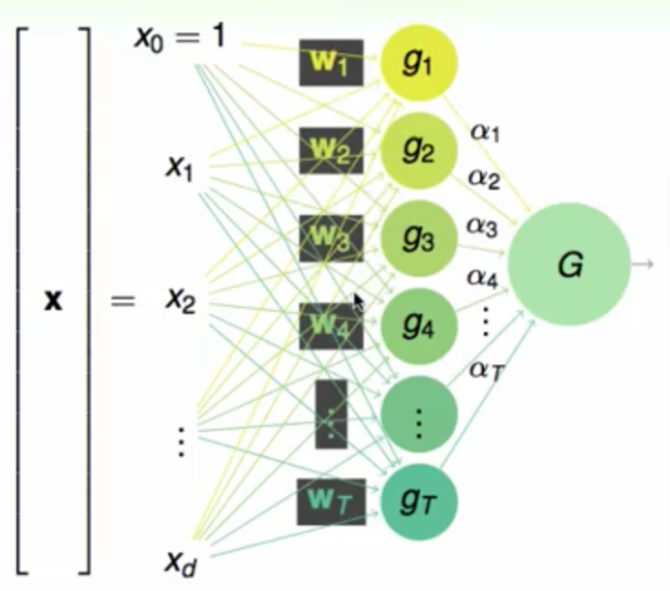
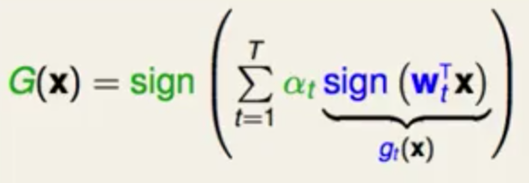
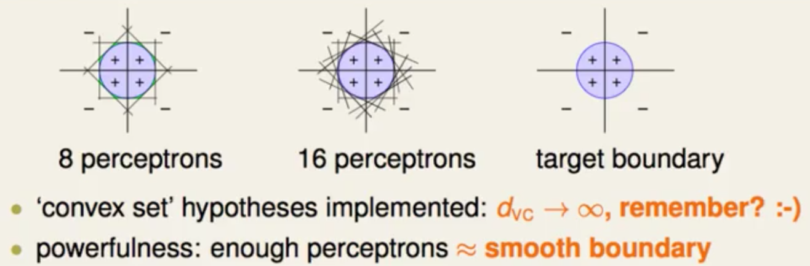

#Concept: Neural Network

---
#### Contents
* []

---

### Linear aggregation of perception

* 从perception的线性组合引入

	 

	对于圆形的H，d_vc趋近于无穷<b>(???)</b>，因为是无穷个perception组合而成 

	

	经典地，XOR无法表示：非线性可分
	
* 通过增加Layer